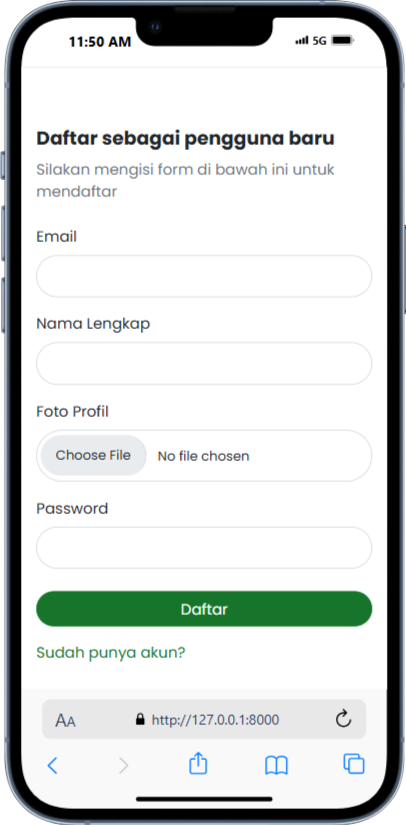
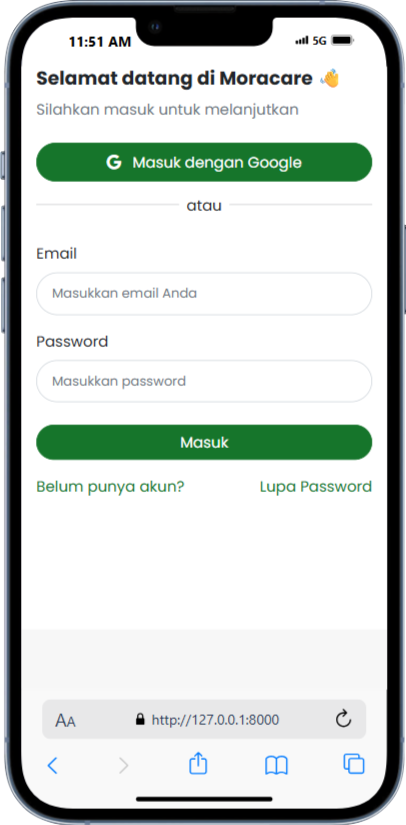
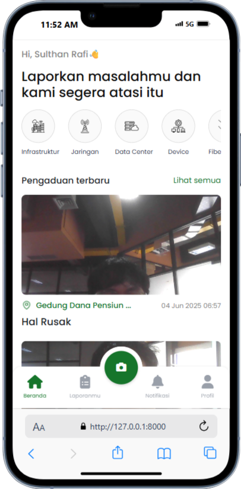
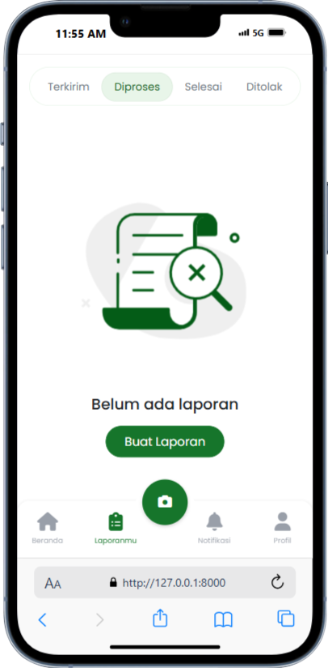
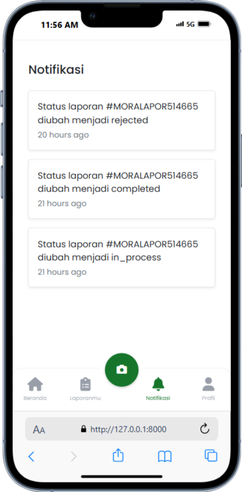
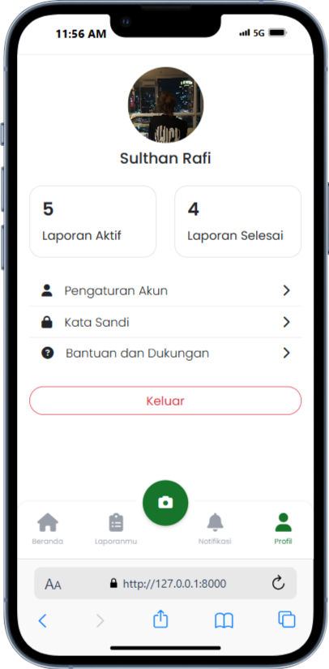
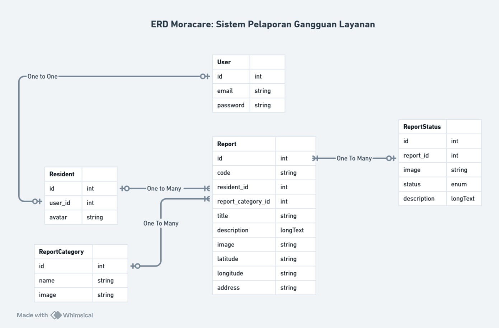

# 🏘️ Moracare - Reporting System

Laravel-based platform enabling residents to submit local issues and administrators to manage/track report progress efficiently.

## 🌟 Key Features

### 👤 Resident Features
| Feature                  | Description                                                                 |
|--------------------------|-----------------------------------------------------------------------------|
| 🔐 **User Authentication** | Secure registration/login with email verification                           |
| 📝 **Report Submission**  | Submit reports with images, location pins, and detailed descriptions       |
| 🕵️ **Report Tracking**    | Track reports using unique codes (ex: `MORALAPOR-7X2A9B`)                  |
| 📊 **My Reports Dashboard** | View reports filtered by status (Delivered/In Process/Completed/Rejected) |
| 🔔 **Real-time Notifications** | Get notified for status updates and admin responses                       |
| 👤 **Profile Management** | Update profile photo, password, and personal details                       |
| 🗂️ **Category Browsing**  | Browse reports by category (Infrastructure/Fiber Optic/etc.)               |

### 👮 Admin Features
| Feature                     | Description                                                               |
|-----------------------------|---------------------------------------------------------------------------|
| 📊 **Analytics Dashboard**  | Visual reports and statistics (by status/category/timeframe)             |
| 👥 **Resident Management**  | CRUD operations for user accounts                                         |
| 🏷️ **Category Management** | Create/edit report categories with custom icons                          |
| 📋 **Report Workflow**      | Full lifecycle management (priority assignment/status updates/comments)  |
| 📸 **Progress Documentation**| Upload images/updates at each status change                              |
| 📄 **PDF Report Generation**| Export reports and statistics in PDF format                              |
| 🔔 **Automated Notifications**| Auto-notify users on status changes                                      |

---

## 🛠️ Tech Stack
| Component           | Technologies                                                                 |
|---------------------|------------------------------------------------------------------------------|
| **Backend**         | Laravel 10.x (PHP 8.2+)                                                      |
| **Frontend**        | Blade Templates, Tailwind CSS, Alpine.js                                     |
| **Database**        | MySQL 8.0+                                                                   |
| **Auth**            | Laravel Breeze + Spatie Roles/Permissions                                    |
| **Storage**         | Laravel Filesystem (local/S3)                                                |
| **PDF Export**      | Barryvdh/laravel-dompdf                                                     |
| **Notifications**   | Database + Email channels                                                   |
| **UI Components**   | SweetAlert2, Chart.js                                                        |

---

## 📱 User Interface

### 🔐 Signup Page
  
Secure registration with email verification. Includes:
- Email input
- Full name field
- Profile picture upload
- Password setup
- Google OAuth integration
- Link to Signin page ("Sudah punya akun?")

### 🔑 Signin Page
  
Secure authentication featuring:
- Google Sign-In option
- Email/password login
- Password recovery ("Lupa Password")
- Registration redirect ("Belum punya akun?")

### 🏠 Home Page
  
User dashboard with:
- Personalized greeting
- Quick-access buttons (Reports/Profile/Notifications)
- Report category filtering
- Latest report preview
- New report FAB (camera button)

### 📋 My Reports Page
  
Report management hub:
- Status-filtered reports (In Process/Completed/etc.)
- Category browsing
- Report thumbnails and metadata
- New report FAB

### 🔔 Notifications Page
  
Real-time updates:
- Status change alerts (e.g., `#MORALAPOR514665 rejected`)
- Timestamped history
- Actionable notifications
- New report FAB

### 👤 Profile Page
  
Account management:
- Personal info display
- Report statistics (Active/Completed)
- Account settings (Password/Details)
- Support access
- Logout control

---

## 🗄️ System Architecture
### Entity Relationship Diagram


### 🔄 Workflow Diagram
```mermaid
graph TD
    A[User] --> B(Submit Report)
    B --> C{System Validation}
    C -->|Valid| D[Status: Delivered]
    C -->|Invalid| E[Reject + Notify User]
    D --> F[Admin Review]
    F --> G{Decision}
    G -->|Approve| H[Status: In Process]
    G -->|Reject| E
    H --> I[Assign to Officer]
    I --> J[Field Investigation]
    J --> K{Completed?}
    K -->|Yes| L[Status: Completed]
    K -->|No| M[Add Progress Update]
    M --> J
    L --> N[Notify User]
    N --> O[User Feedback]
    O --> P[Close Case]